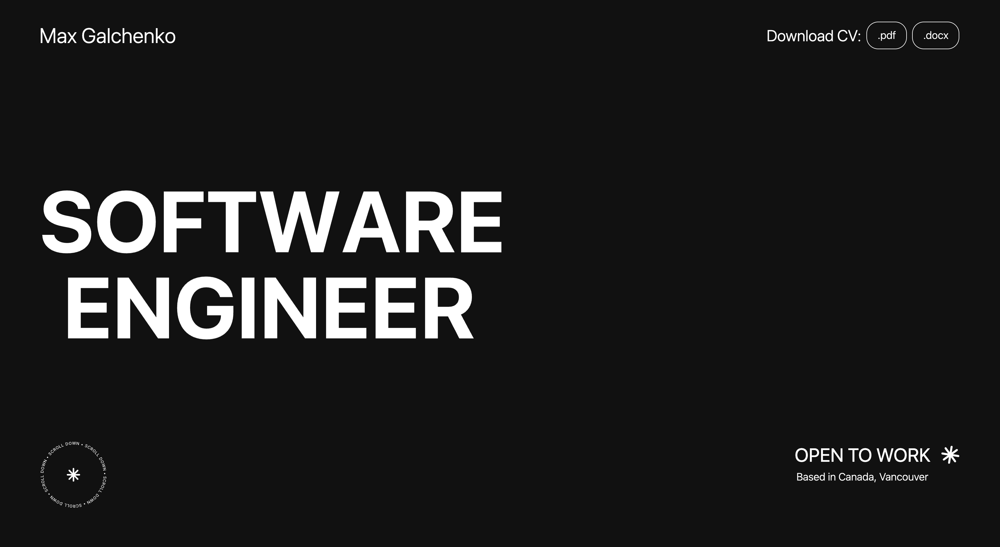

<!-- AI INSTRUCTIONS FOR README GENERATION:

RULES:
1. NEVER remove, add, or reorder sections - use the template structure exactly as provided
2. ONLY replace content inside square brackets [like this] with project-specific information
3. UPDATE the Project Badges section - remove unused badges, add relevant ones for the actual tech stack
4. KEEP all other formatting, styling, and markdown structure unchanged
5. MAINTAIN all links and social badges in the footer exactly as provided -->

# Portfolio

<!-- PROJECT BADGES -->

  

## Project Overview

A personal portfolio website built with React and TypeScript. It highlights selected companies and work experience, provides quick access to my CV and contact links, and features responsive layout, smooth page transitions, and a clean, accessible UI.

## Prerequisites

Make sure you have the following installed on your system:

- **Node.js**: `18.17.0` or higher
- **Yarn**: `1.22.0` or higher

---

**Built with ❤️ by [Maksym Galchenko](https://github.com/maxgalchenko)**

